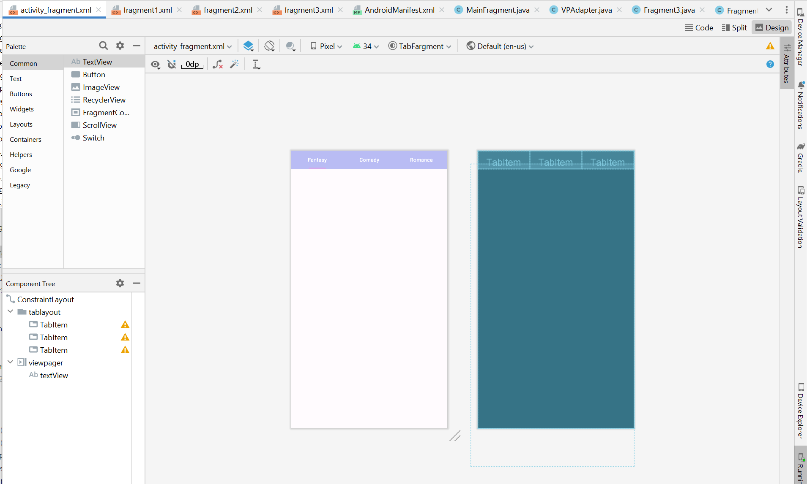

# Tab Fragment
```
Febriyani Nurhida
312210222
TI.22.A2
```

# FRAGMENT - ANDROID STUDIO

Dalam konteks pengembangan perangkat lunak Android menggunakan Android Studio, "fragment" adalah salah satu komponen dasar yang digunakan untuk membangun antarmuka pengguna yang modular. Fragment dapat dianggap sebagai bagian dari tata letak atau antarmuka pengguna yang dapat diubah secara independen, dan mereka dapat digunakan untuk membuat antarmuka yang responsif dan mudah dielola.


## Langkah-Langkah
### 1. Buat Activity baru, di sini saya beri nama Main Fragment
#### Java Class

```
package com.example.tabfargment;

import android.os.Bundle;

import androidx.appcompat.app.AppCompatActivity;
import androidx.fragment.app.FragmentPagerAdapter;
import androidx.viewpager.widget.ViewPager;

import com.google.android.material.tabs.TabLayout;

public class MainFragment extends AppCompatActivity {

    private TabLayout tabLayout;
    private ViewPager viewPager;

    @Override
    protected void onCreate(Bundle savedInstanceState) {
        super.onCreate(savedInstanceState);
        setContentView(R.layout.activity_fragment);

        tabLayout = findViewById(R.id.tablayout);
        viewPager = findViewById(R.id.viewpager);

        tabLayout.setupWithViewPager(viewPager);

        VPAdapter vpAdapter = new VPAdapter(getSupportFragmentManager(),FragmentPagerAdapter.BEHAVIOR_RESUME_ONLY_CURRENT_FRAGMENT);
        vpAdapter.addFragment(new Fragment1(),"Fantasy");
        vpAdapter.addFragment(new Fragment2(),"Comedy");
        vpAdapter.addFragment(new Fragment3(),"Romance");
        viewPager.setAdapter(vpAdapter);
    }


}

```

#### Layout (File xml)
```
<?xml version="1.0" encoding="utf-8"?>
<androidx.constraintlayout.widget.ConstraintLayout xmlns:android="http://schemas.android.com/apk/res/android"
    xmlns:app="http://schemas.android.com/apk/res-auto"
    xmlns:tools="http://schemas.android.com/tools"
    android:layout_width="match_parent"
    android:layout_height="match_parent"
    tools:context=".MainFragment">

    <com.google.android.material.tabs.TabLayout
        android:id="@+id/tablayout"
        android:layout_width="match_parent"
        android:layout_height="wrap_content"
        android:backgroundTint="#B9BCF4"
        app:tabTextColor="@color/white"
        app:tabIndicatorColor="#D1A9ED"
        tools:ignore="MissingConstraints">

        <com.google.android.material.tabs.TabItem
            android:layout_width="wrap_content"
            android:layout_height="wrap_content"
            android:text="Fantasy" />

        <com.google.android.material.tabs.TabItem
            android:layout_width="wrap_content"
            android:layout_height="wrap_content"
            android:text="Comedy" />

        <com.google.android.material.tabs.TabItem
            android:layout_width="wrap_content"
            android:layout_height="wrap_content"
            android:text="Romance" />
    </com.google.android.material.tabs.TabLayout>

    <androidx.viewpager.widget.ViewPager
        android:id="@+id/viewpager"
        android:layout_width="430dp"
        android:layout_height="796dp"
        app:layout_constraintBottom_toBottomOf="parent"
        app:layout_constraintEnd_toEndOf="parent"
        app:layout_constraintHorizontal_bias="1.0"
        app:layout_constraintStart_toStartOf="parent"
        app:layout_constraintTop_toBottomOf="@+id/tablayout"
        app:layout_constraintVertical_bias="0.111">

        <TextView
            android:id="@+id/textView"
            android:layout_width="match_parent"
            android:layout_height="wrap_content"
            android:fontFamily="serif"
            android:text=""
            android:textAlignment="center"
            android:textColor="@color/white"
            android:textSize="34sp"
            android:textStyle="bold" />
    </androidx.viewpager.widget.ViewPager>


</androidx.constraintlayout.widget.ConstraintLayout>
```

design nya akan seperti ini :



### Kemudian buat activity baru, di sini saya beri nama Fragment1

#### Java Class

```
package com.example.tabfargment;

import android.os.Bundle;

import androidx.fragment.app.Fragment;

import android.view.LayoutInflater;
import android.view.View;
import android.view.ViewGroup;
import android.widget.LinearLayout;

public class Fragment1 extends Fragment {

    @Override
    public View onCreateView(LayoutInflater inflater, ViewGroup container,
                             Bundle savedInstanceState) {
        // Inflate the layout for this fragment
        return inflater.inflate(R.layout.fragment1, container, false);

    }

}
```

#### Layout (File xml)
```
<?xml version="1.0" encoding="utf-8"?>
<RelativeLayout xmlns:android="http://schemas.android.com/apk/res/android"
    xmlns:tools="http://schemas.android.com/tools"
    android:layout_width="match_parent"
    android:layout_height="match_parent"
    xmlns:app="http://schemas.android.com/apk/res-auto"
    android:background="#EACDE9"
    tools:context=".Fragment1">

    <!-- TODO: Update blank fragment layout -->

    <LinearLayout
        android:layout_width="wrap_content"
        android:layout_height="wrap_content"
        android:layout_alignParentTop="true"
        android:layout_marginLeft="16dp"
        android:layout_marginTop="57dp"
        android:layout_marginRight="16dp"
        android:orientation="vertical">

        <LinearLayout
            android:layout_width="match_parent"
            android:layout_height="150dp"
            android:layout_margin="5dp"
            android:layout_marginStart="5dp"
            android:layout_marginTop="5dp"
            android:layout_marginEnd="5dp"
            android:layout_marginBottom="5dp"
            android:orientation="horizontal">

            <androidx.cardview.widget.CardView
                android:id="@+id/onepiece"
                android:layout_width="match_parent"
                android:layout_height="match_parent"
                android:layout_margin="10dp"
                android:layout_weight="1"
                app:cardCornerRadius="20dp"
                app:cardElevation="7dp">

                <LinearLayout
                    android:layout_width="match_parent"
                    android:layout_height="match_parent"
                    android:background="@color/white"
                    android:orientation="vertical">

                    <ImageView
                        android:id="@+id/imgView0"
                        android:layout_width="match_parent"
                        android:layout_height="wrap_content"
                        android:layout_margin="1dp"
                        android:layout_weight="1"
                        app:srcCompat="@drawable/onepiece" />

                    <TextView
                        android:id="@+id/txtView0"
                        android:layout_width="match_parent"
                        android:layout_height="wrap_content"
                        android:fontFamily="serif"
                        android:text="One Piece"
                        android:textAlignment="center"
                        android:textColor="@color/black"
                        android:textSize="15sp"
                        android:textStyle="bold" />
                </LinearLayout>
            </androidx.cardview.widget.CardView>

            <androidx.cardview.widget.CardView
                android:id="@+id/kimetsu"
                android:layout_width="match_parent"
                android:layout_height="match_parent"
                android:layout_margin="10dp"
                android:layout_weight="1"
                app:cardCornerRadius="20dp"
                app:cardElevation="7dp">

                <LinearLayout
                    android:layout_width="match_parent"
                    android:layout_height="match_parent"
                    android:background="@color/white"
                    android:orientation="vertical">

                    <ImageView
                        android:id="@+id/imgView1"
                        android:layout_width="match_parent"
                        android:layout_height="wrap_content"
                        android:layout_margin="1dp"
                        android:layout_weight="1"
                        app:srcCompat="@drawable/kimetsu" />

                    <TextView
                        android:id="@+id/txtView1"
                        android:layout_width="match_parent"
                        android:layout_height="wrap_content"
                        android:fontFamily="serif"
                        android:text="Kimetsu No Yaiba"
                        android:textAlignment="center"
                        android:textColor="@color/black"
                        android:textSize="15sp"
                        android:textStyle="bold" />
                </LinearLayout>
            </androidx.cardview.widget.CardView>
        </LinearLayout>

        <LinearLayout
            android:layout_width="match_parent"
            android:layout_height="150dp"
            android:layout_margin="5dp"
            android:orientation="horizontal">

            <androidx.cardview.widget.CardView
                android:id="@+id/jujutsu"
                android:layout_width="match_parent"
                android:layout_height="match_parent"
                android:layout_margin="10dp"
                android:layout_weight="1"
                app:cardCornerRadius="20dp"
                app:cardElevation="7dp">

                <LinearLayout
                    android:layout_width="match_parent"
                    android:layout_height="match_parent"
                    android:background="@color/white"
                    android:orientation="vertical">

                    <ImageView
                        android:id="@+id/imgView2"
                        android:layout_width="match_parent"
                        android:layout_height="wrap_content"
                        android:layout_margin="1dp"
                        android:layout_weight="1"
                        app:srcCompat="@drawable/jujutsu" />

                    <TextView
                        android:id="@+id/txtView2"
                        android:layout_width="match_parent"
                        android:layout_height="wrap_content"
                        android:fontFamily="serif"
                        android:text="Jujutsu Kaisen"
                        android:textAlignment="center"
                        android:textColor="@color/black"
                        android:textSize="15sp"
                        android:textStyle="bold" />
                </LinearLayout>
            </androidx.cardview.widget.CardView>

            <androidx.cardview.widget.CardView
                android:id="@+id/attack"
                android:layout_width="match_parent"
                android:layout_height="match_parent"
                android:layout_margin="10dp"
                android:layout_weight="1"
                app:cardCornerRadius="20dp"
                app:cardElevation="7dp">

                <LinearLayout
                    android:layout_width="match_parent"
                    android:layout_height="match_parent"
                    android:background="@color/white"
                    android:orientation="vertical">

                    <ImageView
                        android:id="@+id/imgView3"
                        android:layout_width="match_parent"
                        android:layout_height="wrap_content"
                        android:layout_margin="1dp"
                        android:layout_weight="1"
                        app:srcCompat="@drawable/aot" />

                    <TextView
                        android:id="@+id/txtView3"
                        android:layout_width="match_parent"
                        android:layout_height="wrap_content"
                        android:fontFamily="serif"
                        android:text="Attack On Titan"
                        android:textAlignment="center"
                        android:textColor="@color/black"
                        android:textSize="15sp"
                        android:textStyle="bold" />
                </LinearLayout>
            </androidx.cardview.widget.CardView>
        </LinearLayout>

        <LinearLayout
            android:layout_width="match_parent"
            android:layout_height="150dp"
            android:layout_margin="5dp"
            android:orientation="horizontal">

            <androidx.cardview.widget.CardView
                android:id="@+id/hunter"
                android:layout_width="match_parent"
                android:layout_height="match_parent"
                android:layout_margin="10dp"
                android:layout_weight="1"
                app:cardCornerRadius="20dp"
                app:cardElevation="7dp">

                <LinearLayout
                    android:layout_width="match_parent"
                    android:layout_height="match_parent"
                    android:background="@color/white"
                    android:orientation="vertical">

                    <ImageView
                        android:id="@+id/imgView4"
                        android:layout_width="match_parent"
                        android:layout_height="wrap_content"
                        android:layout_margin="1dp"
                        android:layout_weight="1"
                        app:srcCompat="@drawable/hunter" />

                    <TextView
                        android:id="@+id/txtView4"
                        android:layout_width="match_parent"
                        android:layout_height="wrap_content"
                        android:fontFamily="serif"
                        android:text="Hunter X Hunter"
                        android:textAlignment="center"
                        android:textColor="@color/black"
                        android:textSize="15sp"
                        android:textStyle="bold" />
                </LinearLayout>
            </androidx.cardview.widget.CardView>

            <androidx.cardview.widget.CardView
                android:id="@+id/tokyo"
                android:layout_width="match_parent"
                android:layout_height="match_parent"
                android:layout_margin="10dp"
                android:layout_weight="1"
                app:cardCornerRadius="20dp"
                app:cardElevation="7dp">

                <LinearLayout
                    android:layout_width="match_parent"
                    android:layout_height="match_parent"
                    android:background="@color/white"
                    android:orientation="vertical">

                    <ImageView
                        android:id="@+id/imgView5"
                        android:layout_width="match_parent"
                        android:layout_height="wrap_content"
                        android:layout_margin="1dp"
                        android:layout_weight="1"
                        app:srcCompat="@drawable/tokyorev" />

                    <TextView
                        android:id="@+id/txtView5"
                        android:layout_width="match_parent"
                        android:layout_height="wrap_content"
                        android:fontFamily="serif"
                        android:text="Tokyo Revengers"
                        android:textAlignment="center"
                        android:textColor="@color/black"
                        android:textSize="15sp"
                        android:textStyle="bold" />
                </LinearLayout>
            </androidx.cardview.widget.CardView>
        </LinearLayout>

        <LinearLayout
            android:layout_width="match_parent"
            android:layout_height="150dp"
            android:layout_margin="5dp"
            android:orientation="horizontal">

            <androidx.cardview.widget.CardView
                android:id="@+id/naruto"
                android:layout_width="match_parent"
                android:layout_height="match_parent"
                android:layout_margin="10dp"
                android:layout_weight="1"
                app:cardCornerRadius="20dp"
                app:cardElevation="7dp">

                <LinearLayout
                    android:layout_width="match_parent"
                    android:layout_height="match_parent"
                    android:background="@color/white"
                    android:orientation="vertical">

                    <ImageView
                        android:id="@+id/imgView6"
                        android:layout_width="match_parent"
                        android:layout_height="wrap_content"
                        android:layout_margin="1dp"
                        android:layout_weight="1"
                        app:srcCompat="@drawable/naruto" />

                    <TextView
                        android:id="@+id/txtView6"
                        android:layout_width="match_parent"
                        android:layout_height="wrap_content"
                        android:fontFamily="serif"
                        android:text="Naruto"
                        android:textAlignment="center"
                        android:textColor="@color/black"
                        android:textSize="15sp"
                        android:textStyle="bold" />
                </LinearLayout>
            </androidx.cardview.widget.CardView>

            <androidx.cardview.widget.CardView
                android:id="@+id/doraemon"
                android:layout_width="match_parent"
                android:layout_height="match_parent"
                android:layout_margin="10dp"
                android:layout_weight="1"
                app:cardCornerRadius="20dp"
                app:cardElevation="7dp">

                <LinearLayout
                    android:layout_width="match_parent"
                    android:layout_height="match_parent"
                    android:background="@color/white"
                    android:orientation="vertical">

                    <ImageView
                        android:id="@+id/imgView7"
                        android:layout_width="match_parent"
                        android:layout_height="wrap_content"
                        android:layout_margin="1dp"
                        android:layout_weight="1"
                        app:srcCompat="@drawable/doraemon" />

                    <TextView
                        android:id="@+id/txtView7"
                        android:layout_width="match_parent"
                        android:layout_height="wrap_content"
                        android:fontFamily="serif"
                        android:text="Doraemon"
                        android:textAlignment="center"
                        android:textColor="@color/black"
                        android:textSize="15sp"
                        android:textStyle="bold" />
                </LinearLayout>
            </androidx.cardview.widget.CardView>
        </LinearLayout>

    </LinearLayout>

</RelativeLayout>
```

#### Design nya akan seperti ini


### Kemudian buat lagi activity baru, saya beri nama Fragment2

#### Java Class
```
package com.example.tabfargment;

import android.os.Bundle;

import androidx.fragment.app.Fragment;

import android.view.LayoutInflater;
import android.view.View;
import android.view.ViewGroup;

public class Fragment2 extends Fragment {

    @Override
    public View onCreateView(LayoutInflater inflater, ViewGroup container,
                             Bundle savedInstanceState) {
        // Inflate the layout for this fragment
        return inflater.inflate(R.layout.fragment2, container, false);
    }
}
```

#### Layout (File XML)

```
<?xml version="1.0" encoding="utf-8"?>
<RelativeLayout xmlns:android="http://schemas.android.com/apk/res/android"
    xmlns:tools="http://schemas.android.com/tools"
    android:layout_width="match_parent"
    android:layout_height="match_parent"
    xmlns:app="http://schemas.android.com/apk/res-auto"
    android:background="#EACDE9"
    tools:context=".Fragment2">

    <!-- TODO: Update blank fragment layout -->

    <RelativeLayout
        android:layout_width="match_parent"
        android:layout_height="match_parent">

        <LinearLayout
            android:layout_width="395dp"
            android:layout_height="677dp"
            android:layout_alignParentTop="true"
            android:layout_marginLeft="16dp"
            android:layout_marginTop="54dp"
            android:layout_marginRight="16dp"
            android:orientation="vertical">

            <LinearLayout
                android:layout_width="match_parent"
                android:layout_height="150dp"
                android:layout_margin="5dp"
                android:layout_marginStart="5dp"
                android:layout_marginTop="5dp"
                android:layout_marginEnd="5dp"
                android:layout_marginBottom="5dp"
                android:orientation="horizontal">

                <androidx.cardview.widget.CardView
                    android:id="@+id/cdMnu1"
                    android:layout_width="match_parent"
                    android:layout_height="match_parent"
                    android:layout_margin="10dp"
                    android:layout_weight="1"
                    app:cardCornerRadius="20dp"
                    app:cardElevation="7dp">

                    <LinearLayout
                        android:layout_width="match_parent"
                        android:layout_height="match_parent"
                        android:background="@color/white"
                        android:orientation="vertical">

                        <ImageView
                            android:id="@+id/imgView0"
                            android:layout_width="match_parent"
                            android:layout_height="wrap_content"
                            android:layout_margin="1dp"
                            android:layout_weight="1"
                            app:srcCompat="@drawable/wakiki" />

                        <TextView
                            android:id="@+id/txtView0"
                            android:layout_width="match_parent"
                            android:layout_height="wrap_content"
                            android:fontFamily="serif"
                            android:text="Welcome To Wakiki"
                            android:textAlignment="center"
                            android:textColor="@color/black"
                            android:textSize="15sp"
                            android:textStyle="bold" />
                    </LinearLayout>
                </androidx.cardview.widget.CardView>

                <androidx.cardview.widget.CardView
                    android:id="@+id/cdMnu2"
                    android:layout_width="match_parent"
                    android:layout_height="match_parent"
                    android:layout_margin="10dp"
                    android:layout_weight="1"
                    app:cardCornerRadius="20dp"
                    app:cardElevation="7dp">

                    <LinearLayout
                        android:layout_width="match_parent"
                        android:layout_height="match_parent"
                        android:background="@color/white"
                        android:orientation="vertical">

                        <ImageView
                            android:id="@+id/imgView1"
                            android:layout_width="match_parent"
                            android:layout_height="wrap_content"
                            android:layout_margin="1dp"
                            android:layout_weight="1"
                            app:srcCompat="@drawable/mrqueen" />

                        <TextView
                            android:id="@+id/txtView1"
                            android:layout_width="match_parent"
                            android:layout_height="wrap_content"
                            android:fontFamily="serif"
                            android:text="Mr. Queen"
                            android:textAlignment="center"
                            android:textColor="@color/black"
                            android:textSize="15sp"
                            android:textStyle="bold" />
                    </LinearLayout>
                </androidx.cardview.widget.CardView>
            </LinearLayout>

            <LinearLayout
                android:layout_width="match_parent"
                android:layout_height="150dp"
                android:layout_margin="5dp"
                android:orientation="horizontal">

                <androidx.cardview.widget.CardView
                    android:id="@+id/cdMnu3"
                    android:layout_width="match_parent"
                    android:layout_height="match_parent"
                    android:layout_margin="10dp"
                    android:layout_weight="1"
                    app:cardCornerRadius="20dp"
                    app:cardElevation="7dp">

                    <LinearLayout
                        android:layout_width="match_parent"
                        android:layout_height="match_parent"
                        android:background="@color/white"
                        android:orientation="vertical">

                        <ImageView
                            android:id="@+id/imgView2"
                            android:layout_width="match_parent"
                            android:layout_height="wrap_content"
                            android:layout_margin="1dp"
                            android:layout_weight="1"
                            app:srcCompat="@drawable/again" />

                        <TextView
                            android:id="@+id/txtView2"
                            android:layout_width="match_parent"
                            android:layout_height="wrap_content"
                            android:fontFamily="serif"
                            android:text="18 Again"
                            android:textAlignment="center"
                            android:textColor="@color/black"
                            android:textSize="15sp"
                            android:textStyle="bold" />
                    </LinearLayout>
                </androidx.cardview.widget.CardView>

                <androidx.cardview.widget.CardView
                    android:id="@+id/cdMnu4"
                    android:layout_width="match_parent"
                    android:layout_height="match_parent"
                    android:layout_margin="10dp"
                    android:layout_weight="1"
                    app:cardCornerRadius="20dp"
                    app:cardElevation="7dp">

                    <LinearLayout
                        android:layout_width="match_parent"
                        android:layout_height="match_parent"
                        android:background="@color/white"
                        android:orientation="vertical">

                        <ImageView
                            android:id="@+id/imgView3"
                            android:layout_width="match_parent"
                            android:layout_height="wrap_content"
                            android:layout_margin="1dp"
                            android:layout_weight="1"
                            app:srcCompat="@drawable/mother" />

                        <TextView
                            android:id="@+id/txtView3"
                            android:layout_width="match_parent"
                            android:layout_height="wrap_content"
                            android:fontFamily="serif"
                            android:text="The Good Bad Mother"
                            android:textAlignment="center"
                            android:textColor="@color/black"
                            android:textSize="15sp"
                            android:textStyle="bold" />
                    </LinearLayout>
                </androidx.cardview.widget.CardView>
            </LinearLayout>

            <LinearLayout
                android:layout_width="match_parent"
                android:layout_height="150dp"
                android:layout_margin="5dp"
                android:orientation="horizontal">

                <androidx.cardview.widget.CardView
                    android:id="@+id/cdMnu5"
                    android:layout_width="match_parent"
                    android:layout_height="match_parent"
                    android:layout_margin="10dp"
                    android:layout_weight="1"
                    app:cardCornerRadius="20dp"
                    app:cardElevation="7dp">

                    <LinearLayout
                        android:layout_width="match_parent"
                        android:layout_height="match_parent"
                        android:background="@color/white"
                        android:orientation="vertical">

                        <ImageView
                            android:id="@+id/imgView4"
                            android:layout_width="match_parent"
                            android:layout_height="wrap_content"
                            android:layout_margin="1dp"
                            android:layout_weight="1"
                            app:srcCompat="@drawable/doctor" />

                        <TextView
                            android:id="@+id/txtView4"
                            android:layout_width="match_parent"
                            android:layout_height="wrap_content"
                            android:fontFamily="serif"
                            android:text="Doctor Cha"
                            android:textAlignment="center"
                            android:textColor="@color/black"
                            android:textSize="15sp"
                            android:textStyle="bold" />
                    </LinearLayout>
                </androidx.cardview.widget.CardView>

                <androidx.cardview.widget.CardView
                    android:id="@+id/cdMnu6"
                    android:layout_width="match_parent"
                    android:layout_height="match_parent"
                    android:layout_margin="10dp"
                    android:layout_weight="1"
                    app:cardCornerRadius="20dp"
                    app:cardElevation="7dp">

                    <LinearLayout
                        android:layout_width="match_parent"
                        android:layout_height="match_parent"
                        android:background="@color/white"
                        android:orientation="vertical">

                        <ImageView
                            android:id="@+id/imgView5"
                            android:layout_width="match_parent"
                            android:layout_height="wrap_content"
                            android:layout_margin="1dp"
                            android:layout_weight="1"
                            app:srcCompat="@drawable/gaus" />

                        <TextView
                            android:id="@+id/txtView5"
                            android:layout_width="match_parent"
                            android:layout_height="wrap_content"
                            android:fontFamily="serif"
                            android:text="Gaus Electronics"
                            android:textAlignment="center"
                            android:textColor="@color/black"
                            android:textSize="15sp"
                            android:textStyle="bold" />
                    </LinearLayout>
                </androidx.cardview.widget.CardView>
            </LinearLayout>

            <LinearLayout
                android:layout_width="match_parent"
                android:layout_height="150dp"
                android:layout_margin="5dp"
                android:orientation="horizontal">

                <androidx.cardview.widget.CardView
                    android:id="@+id/cdMnu7"
                    android:layout_width="match_parent"
                    android:layout_height="match_parent"
                    android:layout_margin="10dp"
                    android:layout_weight="1"
                    app:cardCornerRadius="20dp"
                    app:cardElevation="7dp">

                    <LinearLayout
                        android:layout_width="match_parent"
                        android:layout_height="match_parent"
                        android:background="@color/white"
                        android:orientation="vertical">

                        <ImageView
                            android:id="@+id/imgView6"
                            android:layout_width="match_parent"
                            android:layout_height="wrap_content"
                            android:layout_margin="1dp"
                            android:layout_weight="1"
                            app:srcCompat="@drawable/farmer" />

                        <TextView
                            android:id="@+id/txtView6"
                            android:layout_width="match_parent"
                            android:layout_height="wrap_content"
                            android:fontFamily="serif"
                            android:text="Modern Farmer"
                            android:textAlignment="center"
                            android:textColor="@color/black"
                            android:textSize="15sp"
                            android:textStyle="bold" />
                    </LinearLayout>
                </androidx.cardview.widget.CardView>

                <androidx.cardview.widget.CardView
                    android:id="@+id/cdMnu8"
                    android:layout_width="match_parent"
                    android:layout_height="match_parent"
                    android:layout_margin="10dp"
                    android:layout_weight="1"
                    app:cardCornerRadius="20dp"
                    app:cardElevation="7dp">

                    <LinearLayout
                        android:layout_width="match_parent"
                        android:layout_height="match_parent"
                        android:background="@color/white"
                        android:orientation="vertical">

                        <ImageView
                            android:id="@+id/imgView7"
                            android:layout_width="match_parent"
                            android:layout_height="wrap_content"
                            android:layout_margin="1dp"
                            android:layout_weight="1"
                            app:srcCompat="@drawable/fiery" />

                        <TextView
                            android:id="@+id/txtView7"
                            android:layout_width="match_parent"
                            android:layout_height="wrap_content"
                            android:fontFamily="serif"
                            android:text="The Fiery Priest"
                            android:textAlignment="center"
                            android:textColor="@color/black"
                            android:textSize="15sp"
                            android:textStyle="bold" />
                    </LinearLayout>
                </androidx.cardview.widget.CardView>
            </LinearLayout>

        </LinearLayout>
    </RelativeLayout>

</RelativeLayout>
```
#### Design nya akan seperti ini :


### Kemudian Activity baru lagi, saya beri nama Fragment3

#### Java Class
```
package com.example.tabfargment;

import android.os.Bundle;

import androidx.fragment.app.Fragment;

import android.view.LayoutInflater;
import android.view.View;
import android.view.ViewGroup;

public class Fragment3 extends Fragment {

    @Override
    public View onCreateView(LayoutInflater inflater, ViewGroup container,
                             Bundle savedInstanceState) {
        // Inflate the layout for this fragment
        return inflater.inflate(R.layout.fragment3, container, false);
    }
}
```

#### Layout (File XML)

```
<?xml version="1.0" encoding="utf-8"?>
<RelativeLayout xmlns:android="http://schemas.android.com/apk/res/android"
    xmlns:tools="http://schemas.android.com/tools"
    android:layout_width="match_parent"
    android:layout_height="match_parent"
    xmlns:app="http://schemas.android.com/apk/res-auto"
    android:background="#EACDE9"
    tools:context=".Fragment3">

    <!-- TODO: Update blank fragment layout -->
    <RelativeLayout
        android:layout_width="match_parent"
        android:layout_height="match_parent">

    </RelativeLayout>

    <LinearLayout
        android:layout_width="wrap_content"
        android:layout_height="wrap_content"
        android:layout_alignParentTop="true"
        android:layout_marginLeft="16dp"
        android:layout_marginTop="57dp"
        android:layout_marginRight="16dp"
        android:orientation="vertical">

        <LinearLayout
            android:layout_width="match_parent"
            android:layout_height="150dp"
            android:layout_margin="5dp"
            android:orientation="horizontal">

            <androidx.cardview.widget.CardView
                android:id="@+id/cdMnu1"
                android:layout_width="match_parent"
                android:layout_height="match_parent"
                android:layout_margin="10dp"
                android:layout_weight="1"
                app:cardCornerRadius="20dp"
                app:cardElevation="7dp">

                <LinearLayout
                    android:layout_width="match_parent"
                    android:layout_height="match_parent"
                    android:background="@color/white"
                    android:orientation="vertical">

                    <ImageView
                        android:id="@+id/imgView0"
                        android:layout_width="match_parent"
                        android:layout_height="wrap_content"
                        android:layout_margin="1dp"
                        android:layout_weight="1"
                        app:srcCompat="@drawable/doona" />

                    <TextView
                        android:id="@+id/txtView0"
                        android:layout_width="match_parent"
                        android:layout_height="wrap_content"
                        android:fontFamily="serif"
                        android:text="Doona"
                        android:textAlignment="center"
                        android:textColor="@color/black"
                        android:textSize="15sp"
                        android:textStyle="bold" />
                </LinearLayout>
            </androidx.cardview.widget.CardView>

            <androidx.cardview.widget.CardView
                android:id="@+id/cdMnu2"
                android:layout_width="match_parent"
                android:layout_height="match_parent"
                android:layout_margin="10dp"
                android:layout_weight="1"
                app:cardCornerRadius="20dp"
                app:cardElevation="7dp">

                <LinearLayout
                    android:layout_width="match_parent"
                    android:layout_height="match_parent"
                    android:background="@color/white"
                    android:orientation="vertical">

                    <ImageView
                        android:id="@+id/imgView1"
                        android:layout_width="match_parent"
                        android:layout_height="wrap_content"
                        android:layout_margin="1dp"
                        android:layout_weight="1"
                        app:srcCompat="@drawable/goblin" />

                    <TextView
                        android:id="@+id/txtView1"
                        android:layout_width="match_parent"
                        android:layout_height="wrap_content"
                        android:fontFamily="serif"
                        android:text="Goblin"
                        android:textAlignment="center"
                        android:textColor="@color/black"
                        android:textSize="15sp"
                        android:textStyle="bold" />
                </LinearLayout>
            </androidx.cardview.widget.CardView>
        </LinearLayout>

        <LinearLayout
            android:layout_width="match_parent"
            android:layout_height="150dp"
            android:layout_margin="5dp"
            android:orientation="horizontal">

            <androidx.cardview.widget.CardView
                android:id="@+id/cdMnu3"
                android:layout_width="match_parent"
                android:layout_height="match_parent"
                android:layout_margin="10dp"
                android:layout_weight="1"
                app:cardCornerRadius="20dp"
                app:cardElevation="7dp">

                <LinearLayout
                    android:layout_width="match_parent"
                    android:layout_height="match_parent"
                    android:background="@color/white"
                    android:orientation="vertical">

                    <ImageView
                        android:id="@+id/imgView2"
                        android:layout_width="match_parent"
                        android:layout_height="wrap_content"
                        android:layout_margin="1dp"
                        android:layout_weight="1"
                        app:srcCompat="@drawable/legend" />

                    <TextView
                        android:id="@+id/txtView2"
                        android:layout_width="match_parent"
                        android:layout_height="wrap_content"
                        android:fontFamily="serif"
                        android:text="TLOTBS"
                        android:textAlignment="center"
                        android:textColor="@color/black"
                        android:textSize="15sp"
                        android:textStyle="bold" />
                </LinearLayout>
            </androidx.cardview.widget.CardView>

            <androidx.cardview.widget.CardView
                android:id="@+id/cdMnu4"
                android:layout_width="match_parent"
                android:layout_height="match_parent"
                android:layout_margin="10dp"
                android:layout_weight="1"
                app:cardCornerRadius="20dp"
                app:cardElevation="7dp">

                <LinearLayout
                    android:layout_width="match_parent"
                    android:layout_height="match_parent"
                    android:background="@color/white"
                    android:orientation="vertical">

                    <ImageView
                        android:id="@+id/imgView3"
                        android:layout_width="match_parent"
                        android:layout_height="wrap_content"
                        android:layout_margin="1dp"
                        android:layout_weight="1"
                        app:srcCompat="@drawable/melancholia" />

                    <TextView
                        android:id="@+id/txtView3"
                        android:layout_width="match_parent"
                        android:layout_height="wrap_content"
                        android:fontFamily="serif"
                        android:text="Melancholia"
                        android:textAlignment="center"
                        android:textColor="@color/black"
                        android:textSize="15sp"
                        android:textStyle="bold" />
                </LinearLayout>
            </androidx.cardview.widget.CardView>
        </LinearLayout>

        <LinearLayout
            android:layout_width="match_parent"
            android:layout_height="150dp"
            android:layout_margin="5dp"
            android:orientation="horizontal">

            <androidx.cardview.widget.CardView
                android:id="@+id/cdMnu5"
                android:layout_width="match_parent"
                android:layout_height="match_parent"
                android:layout_margin="10dp"
                android:layout_weight="1"
                app:cardCornerRadius="20dp"
                app:cardElevation="7dp">

                <LinearLayout
                    android:layout_width="match_parent"
                    android:layout_height="match_parent"
                    android:background="@color/white"
                    android:orientation="vertical">

                    <ImageView
                        android:id="@+id/imgView4"
                        android:layout_width="match_parent"
                        android:layout_height="wrap_content"
                        android:layout_margin="1dp"
                        android:layout_weight="1"
                        app:srcCompat="@drawable/cloy" />

                    <TextView
                        android:id="@+id/txtView4"
                        android:layout_width="match_parent"
                        android:layout_height="wrap_content"
                        android:fontFamily="serif"
                        android:text="Crash Landing O-Y"
                        android:textAlignment="center"
                        android:textColor="@color/black"
                        android:textSize="15sp"
                        android:textStyle="bold" />
                </LinearLayout>
            </androidx.cardview.widget.CardView>

            <androidx.cardview.widget.CardView
                android:id="@+id/cdMnu6"
                android:layout_width="match_parent"
                android:layout_height="match_parent"
                android:layout_margin="10dp"
                android:layout_weight="1"
                app:cardCornerRadius="20dp"
                app:cardElevation="7dp">

                <LinearLayout
                    android:layout_width="match_parent"
                    android:layout_height="match_parent"
                    android:background="@color/white"
                    android:orientation="vertical">

                    <ImageView
                        android:id="@+id/imgView5"
                        android:layout_width="match_parent"
                        android:layout_height="wrap_content"
                        android:layout_margin="1dp"
                        android:layout_weight="1"
                        app:srcCompat="@drawable/meteor" />

                    <TextView
                        android:id="@+id/txtView5"
                        android:layout_width="match_parent"
                        android:layout_height="wrap_content"
                        android:fontFamily="serif"
                        android:text="Meteor Garden"
                        android:textAlignment="center"
                        android:textColor="@color/black"
                        android:textSize="15sp"
                        android:textStyle="bold" />
                </LinearLayout>
            </androidx.cardview.widget.CardView>
        </LinearLayout>

        <LinearLayout
            android:layout_width="match_parent"
            android:layout_height="150dp"
            android:layout_margin="5dp"
            android:orientation="horizontal">

            <androidx.cardview.widget.CardView
                android:id="@+id/cdMnu7"
                android:layout_width="match_parent"
                android:layout_height="match_parent"
                android:layout_margin="10dp"
                android:layout_weight="1"
                app:cardCornerRadius="20dp"
                app:cardElevation="7dp">

                <LinearLayout
                    android:layout_width="match_parent"
                    android:layout_height="match_parent"
                    android:background="@color/white"
                    android:orientation="vertical">

                    <ImageView
                        android:id="@+id/imgView6"
                        android:layout_width="match_parent"
                        android:layout_height="wrap_content"
                        android:layout_margin="1dp"
                        android:layout_weight="1"
                        app:srcCompat="@drawable/scarlet" />

                    <TextView
                        android:id="@+id/txtView6"
                        android:layout_width="match_parent"
                        android:layout_height="wrap_content"
                        android:fontFamily="serif"
                        android:text="Scarlet Heart Ryeo"
                        android:textAlignment="center"
                        android:textColor="@color/black"
                        android:textSize="15sp"
                        android:textStyle="bold" />
                </LinearLayout>
            </androidx.cardview.widget.CardView>

            <androidx.cardview.widget.CardView
                android:id="@+id/cdMnu8"
                android:layout_width="match_parent"
                android:layout_height="match_parent"
                android:layout_margin="10dp"
                android:layout_weight="1"
                app:cardCornerRadius="20dp"
                app:cardElevation="7dp">

                <LinearLayout
                    android:layout_width="match_parent"
                    android:layout_height="match_parent"
                    android:background="@color/white"
                    android:orientation="vertical">

                    <ImageView
                        android:id="@+id/imgView7"
                        android:layout_width="match_parent"
                        android:layout_height="wrap_content"
                        android:layout_margin="1dp"
                        android:layout_weight="1"
                        app:srcCompat="@drawable/trueb" />

                    <TextView
                        android:id="@+id/txtView7"
                        android:layout_width="match_parent"
                        android:layout_height="wrap_content"
                        android:fontFamily="serif"
                        android:text="True Beauty"
                        android:textAlignment="center"
                        android:textColor="@color/black"
                        android:textSize="15sp"
                        android:textStyle="bold" />
                </LinearLayout>
            </androidx.cardview.widget.CardView>
        </LinearLayout>

    </LinearLayout>

</RelativeLayout>
```

#### Design nya akan seperti ini:


### Terakhir, Siapkan Java Class Untuk VPAdapter dan jangan lupa juga android manifestnya

#### VPAdapter
```
package com.example.tabfargment;

import androidx.annotation.NonNull;
import androidx.fragment.app.Fragment;
import androidx.fragment.app.FragmentManager;
import androidx.fragment.app.FragmentPagerAdapter;

import org.jetbrains.annotations.Nullable;

import java.util.ArrayList;

public class VPAdapter extends FragmentPagerAdapter {

    private  final ArrayList<Fragment> fragmentArrayList = new ArrayList<>();
    private  final ArrayList<String> fragmentTitle = new ArrayList<>();

    public VPAdapter(@NonNull FragmentManager fm, int behavior) {
        super(fm, behavior);
    }

    @NonNull
    @Override
    public Fragment getItem(int position) {

        return fragmentArrayList.get(position);
    }

    @Override
    public int getCount() {
        return fragmentArrayList.size();
    }

    public void addFragment(Fragment fragment, String title) {
        fragmentArrayList.add(fragment);
        fragmentTitle.add(title);
    }

    @Nullable
    @Override

    public CharSequence getPageTitle(int position) {

        return fragmentTitle.get(position);


    }
}

```

#### AndoridManifest
```
<?xml version="1.0" encoding="utf-8"?>
<manifest xmlns:android="http://schemas.android.com/apk/res/android"
    xmlns:tools="http://schemas.android.com/tools">

    <application
        android:allowBackup="true"
        android:dataExtractionRules="@xml/data_extraction_rules"
        android:fullBackupContent="@xml/backup_rules"
        android:icon="@mipmap/ic_launcher"
        android:label="@string/app_name"
        android:roundIcon="@mipmap/ic_launcher_round"
        android:supportsRtl="true"
        android:theme="@style/Theme.TabFargment"
        tools:targetApi="31">
        <activity
            android:name=".Fragment3"
            android:exported="false" />
        <activity
            android:name=".Fragment2"
            android:exported="false" />
        <activity
            android:name=".Fragment1"
            android:exported="false" />
        <activity
            android:name=".MainFragment"
            android:exported="true">
            <intent-filter>
                <action android:name="android.intent.action.MAIN" />

                <category android:name="android.intent.category.LAUNCHER" />
            </intent-filter>
        </activity>
    </application>

</manifest>
```
## Output

